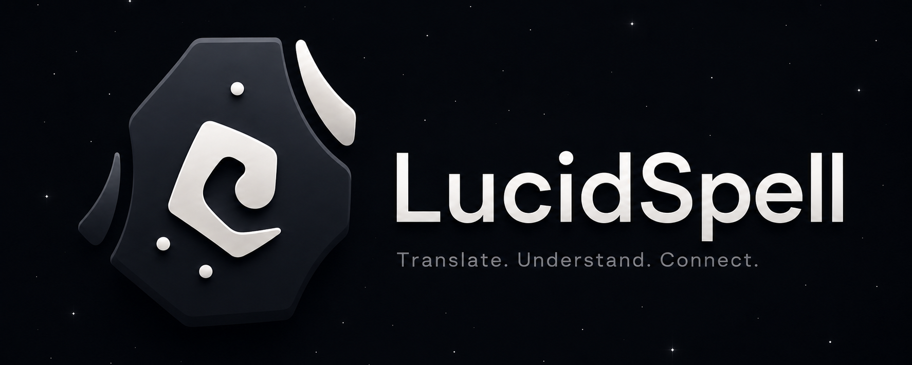
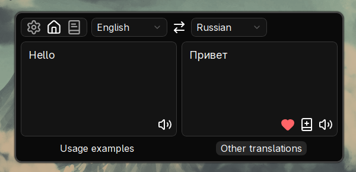
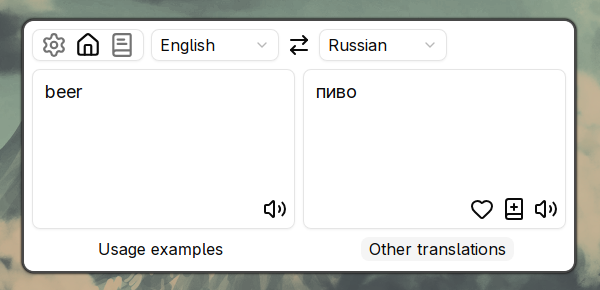
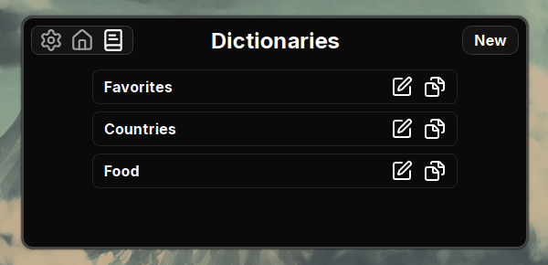

## Lucid Spell

A desktop translator powered by LLMs, it uses your API key to translate text. Built with Tauri 2 + React + TypeScript + Tailwind CSS.

## Screenshots

  
  

  

## Download

[Download latest release](https://github.com/l1ngus/lucid-spell/releases)

## Features

- Translate text using any OpenAI-compatible API (remote or local)
- Language auto-detection via `whatlang`
- Text-to-speech with Microsoft Edge TTS voices
- Custom dictionaries & flashcards
- Proxy support (SOCKS5/HTTP/HTTPS)
- Keyboard shortcuts
